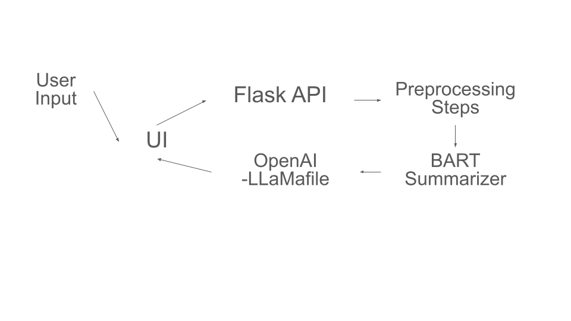

# Book Summarizer

## Overview
Book Summarizer is a web application that allows users to search for and view summaries of books. The application features a modern, responsive design built with React for the frontend and Flask for the backend. 

## Features
1. Search for books by title.
2. View detailed summaries of books.
3. Modern, responsive design built with React.

## Requirements
- Docker
- Docker Compose

## CI/CD Status


## Final Demo Video


## Architecture Diagram


## Getting Started

### Running Locally with Docker
1. **Download Llamafile**
   https://huggingface.co/Mozilla/Meta-Llama-3-8B-Instruct-llamafile/resolve/main/Meta-Llama-3-8B-Instruct.Q5_K_M.llamafile?download=true - Meta-Llama-3-8B Instruct model
2. If you're using macOS, Linux, or BSD, you'll need to grant permission for your computer to execute this new file. (You only need to do this once.)
```
chmod +x <llamafilename>.llamafile
```
3. Run the llamafile. e.g.:
```
./<llamafilename>.llamafile
```
4. **Clone the Repository**
    ```bash
    git clone https://github.com/pallesaisamyukta/AIPI561Book.git
    cd AIPI561Book
    ```

5. **Build and Run with Docker Compose**
    ```bash
    docker-compose up --build
    ```
    This command will build the Docker images and start the containers for both the frontend and backend. The application will be accessible at [http://localhost:3000](http://localhost:3000).

### Running Tests
- **Frontend Tests**
    ```bash
    cd frontend
    npm test
    ```

- **Backend Tests**
    ```bash
    cd backend
    python -m unittest discover -s tests
    ```

### Performance and Evaluation
- **Frontend Performance**: The React frontend is optimized for fast rendering and minimal loading times. Performance benchmarks can be found in the `frontend/performance` folder.
- **Backend Performance**: The Flask backend is designed to handle multiple requests efficiently. Performance metrics are available in the `backend/performance` folder.

## File Structure
/AIPI561Book
├── backend/
│ ├── app.py
│ ├── requirements.txt
│ summary.py
│ app.py
|
│ └── tests/
│ ├── init.py
│ ├── test_summary.py
│ ├── test_app.py
|
├── frontend/
│ ├── public/
│ ├── src/
│ │ ├── components/
│ │ │ ├── App.js
│ │ │ ├── Header.js
│ │ │ ├── Search.js
│ │ ├── pages/
│ │ │ ├── HomePage.js
│ │ ├── App.test.js
│ ├── package.json
│ ├── Dockerfile
│ └── docker-compose.yml
│
├── .github/
│ └── workflows/
│ └── ci_cd.yml
└── README.md


### Major Folders and Files

1. **backend/**
   - `app.py`: Main entry point for the Flask application. Sets up routes and handles requests.
   - `requirements.txt`: Lists required Python packages for the backend.
   - `summary.py`: Contains the script for preprocessing i.e., reading the file, performing BART Summarizer & the OpenAI- LLamaFile for giving summary.
   - `tests/`: Unit tests for the backend.
     - `__init__.py`: Initializes the tests package.
     - `test_summary.py`: Unit tests for summarization functions.
     - `test_app.py`: Unit tests for Flask Application.

2. **frontend/**
   - `public/`: Static assets and main HTML file for the React application.
   - `src/`: Source code for the React application.
     - `components/`: Reusable React components.
       - `App.js`: Root component.
       - `Header.js`: Application header.
       - `Search.js`: Search functionality.
     - `pages/`: Page components.
       - `HomePage.js`: Home page component.
     - `App.test.js`: Tests for `App.js`.
   - `package.json`: Manages dependencies, scripts, and metadata.
   - `Dockerfile`: Instructions for building the Docker image for the frontend.
   - `docker-compose.yml`: Defines and runs multi-container Docker applications.

3. **.github/**
   - `workflows/ci_cd.yml`: CI/CD pipeline configuration for automated testing and deployment.

4. **README.md**: Overview, setup instructions, and usage guidelines for the project.

Also, I am exploring on how to perform the same using RUST. If interested please check - https://github.com/pallesaisamyukta/AIPI561BookRUST

